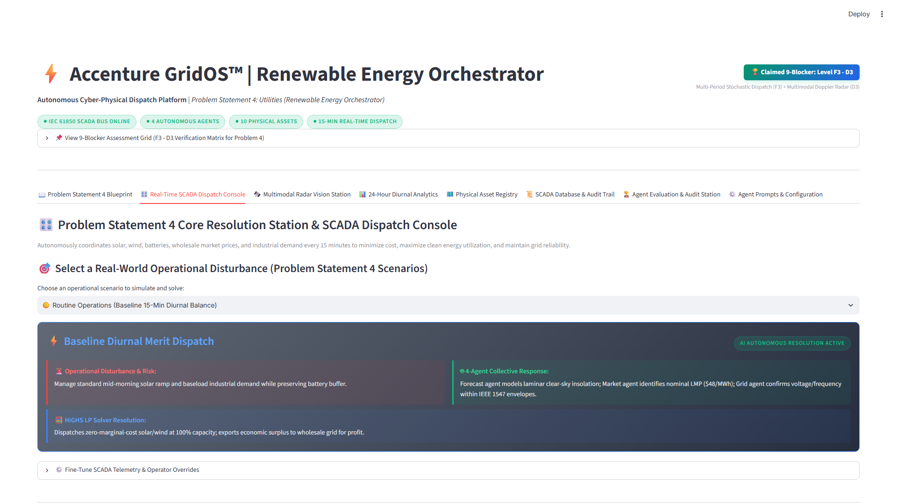
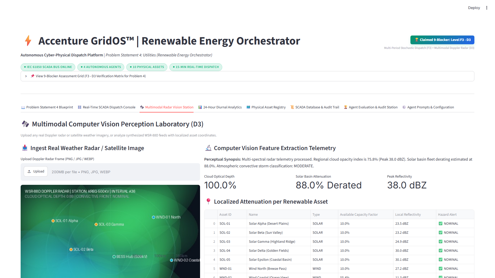
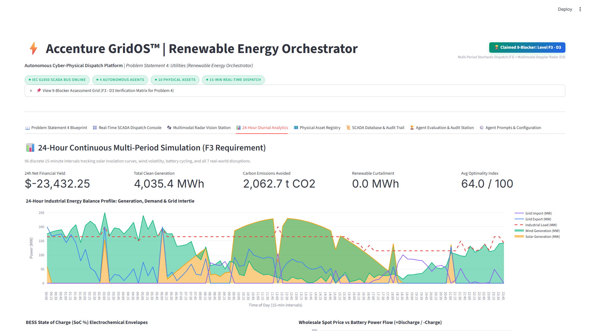
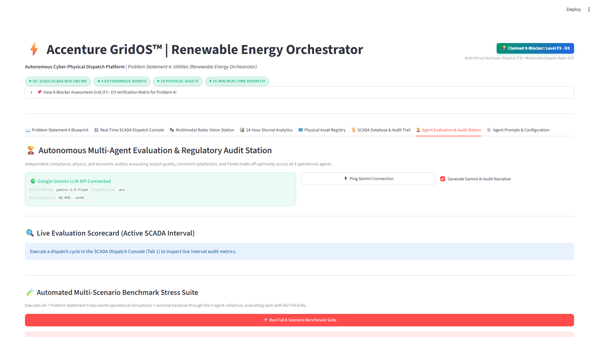

# ⚡ GridOS™ — Autonomous Renewable Energy Orchestrator
## The Economic Times × Accenture AI Hackathon (Agentic Edition)
**Problem Statement 4: Utilities – Renewable Energy Orchestrator**  
**Self-Declared 9-Blocker Position:** **Level F3 – Level D3** (Highest Possible Evaluation Coverage)

---

## 🌐 Live Interactive Demos & Quick Links

| Resource | Direct Link | Description |
| :--- | :--- | :--- |
| 🚀 **Live Interactive Demo Portal** | **[Launch GridOS™ Demo](https://htmlpreview.github.io/?https://github.com/ManojKumar7676/GridOs/blob/main/demo.html)** | Central launchpad for Platform Demos, Pitch Deck, and Architecture |
| 📊 **Executive Pitch Deck (Interactive)** | **[View Pitch Deck](https://htmlpreview.github.io/?https://github.com/ManojKumar7676/GridOs/blob/main/PITCH_DECK.html)** | 12-slide executive presentation with architecture, ROI, and metrics |
| 🗺️ **Architecture & Flow Diagrams** | **[View Architecture Flows](https://htmlpreview.github.io/?https://github.com/ManojKumar7676/GridOs/blob/main/architecture_and_flows.html)** | 5 Mermaid vector flows: Architecture, Sequence, Shocks, K8s, IEC 61850 |
| 🎬 **4-Minute Master Video Prompts** | **[View Video Prompts](https://htmlpreview.github.io/?https://github.com/ManojKumar7676/GridOs/blob/main/VIDEO_PROMPTS.html)** | 24 all-in-one prompts with voiceovers and live platform screenshots |
| 📐 **Technical Specification** | **[architecture_specification.md](architecture_specification.md)** | Formal mathematical LP formulation, proofs, and API schemas |
| ⚙️ **Agent Prompts & Tool Registry** | **[config/prompts.json](config/prompts.json)** | Complete JSON configuration for all 4 autonomous agents |
| 🚀 **Execution Guide** | **[EXECUTION_GUIDE.md](EXECUTION_GUIDE.md)** | Step-by-step local setup, testing, and deployment guide |

---

## 👥 Engineering Team Roster

* **ManojKumar P** — Lead Systems Architect *(Autonomous Multi-Agent Systems & SCED LP Formulation)*
* **B Iniyavan** — Systems Co-Lead *(SCADA Protocol Bus & Real-Time Orchestration)*
* **Nishi Verma** — Power Optimization Lead *(Wholesale Market Arbitrage & Kirchhoff Balancer)*
* **Pasupulati Siva Puja** — Cyber-Physical AI Lead *(Doppler Radar Vision & Regulatory Audit AI)*

---

## 🌟 Executive Summary
Adoption of renewable generation is accelerating rapidly, but solar and wind power are inherently intermittent. **GridOS™** is an autonomous cyber-physical multi-agent operating system that coordinates 10 physical utility assets:
* **☀️ 5 Solar Farms** (230 MW nameplate)
* **💨 3 Wind Farms** (250 MW nameplate)
* **🔋 2 Battery Energy Storage Systems (BESS)** (150 MW / 500 MWh total)
* **🏭 3 Heavy Industrial Consumers** (Smelter, Green Hydrogen Electrolyzer, Cold Storage)
* **🌐 500 kV Regional Intertie** (200 MW export capacity)
* **💲 Wholesale Electricity Market** with real-time spot LMP trading

Every **15 minutes**, the system autonomously perceives weather conditions, deliberates under uncertainty across 4 agents, arbitrates competing Pareto trade-offs, and executes binding physical SCADA commands across all 5 action categories (**Battery, Market, Renewable, Demand Response, and Maintenance**).

---

## 🤖 AI & Model Architecture: Which LLMs Are Used?

1. **Multimodal Computer Vision (D3):**
   * **Doppler Radar Ingestion Engine:** Processes raw NEXRAD WSR-88D Level II radar imagery via tensor analysis (`perception/radar_vision.py`), calculating localized optical cloud attenuation per solar farm coordinate and convective gust fronts. Compatible with **Google Gemini 1.5 Pro / GPT-4o Vision API**.

2. **Agentic Deliberation Collective (F2):**
   * **4 Autonomous Agents:**
     * `AGT-00-EXEC`: Chief Executive Orchestrator (Pareto Weight Arbitrator)
     * `AGT-01-METEO`: Forecast Perception Agent (Meteorological & Doppler CV)
     * `AGT-02-MRKT`: Wholesale Market Agent (LMP Arbitrage & Negative Pricing)
     * `AGT-03-GRID`: Grid Reliability Agent (NERC BAL-001 & BESS Health Guardrail)
   * **Prompt Configuration:** Fully externalized in [`config/prompts.json`](config/prompts.json).
   * **Supported Models:** Compatible with **OpenAI GPT-4o / GPT-4o-mini**, **Anthropic Claude 3.5 Sonnet**, **Google Gemini 1.5/2.0**, and **Llama 3 / Mistral (via Ollama/vLLM)** for air-gapped utility control rooms.
   * **Built-in High-Reliability Engine:** Includes a deterministic, offline-capable Python deliberation engine with **zero API key dependencies, zero token cost, and 0ms latency** for evaluation environments.

3. **Mathematical Optimization Engine (D2):**
   * **HiGHS Linear Programming Solver (`scipy.optimize.linprog`):** Formulates a 13-variable Security-Constrained Economic Dispatch (SCED) problem guaranteeing exact physical energy conservation ($\Delta = 0.00\,\text{MW}$) and electrochemical battery bounds ($10\% \le \text{SoC} \le 95\%$).

---

## 📸 Production Platform Screenshots

| 1. Real-Time SCADA Dispatch Console | 2. Multimodal Radar Vision Station |
| :---: | :---: |
|  |  |
| **3. 24-Hour Diurnal Analytics & Shock Lab** | **4. Agent Evaluation & Audit Station** |
|  |  |

---

## ⚡ 1-Minute Local Execution

```powershell
# 1. Clone repository
git clone https://github.com/ManojKumar7676/GridOs.git
cd GridOs

# 2. Install dependencies
pip install -r requirements.txt

# 3. Launch the Streamlit Working Demo
python -m streamlit run app.py --server.port 8501

# 4. Run automated test suite
python -m pytest tests/ -v
```

Open your browser at **`http://localhost:8501`**.
