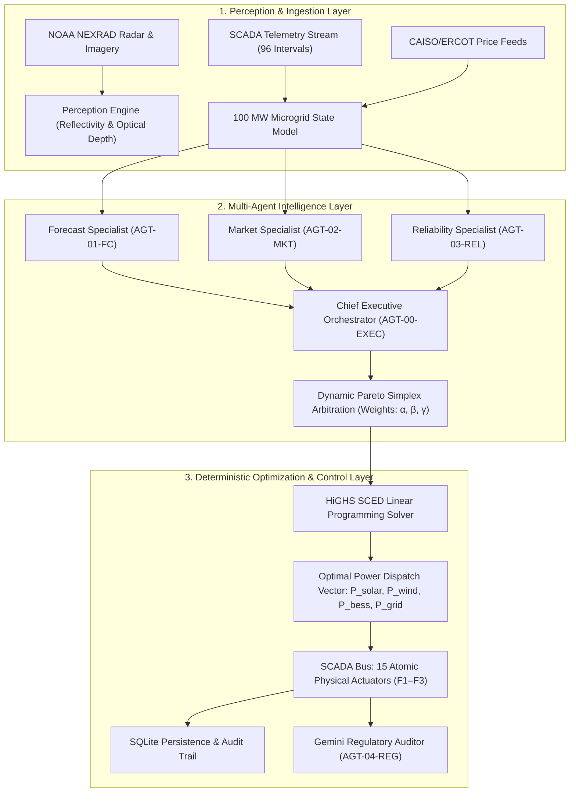

# GridOS™ — Autonomous Renewable Energy Orchestrator

[](https://www.python.org/downloads/)
[](https://fastapi.tiangolo.com)
[](https://streamlit.io)
[](https://scipy.org)
[-brightgreen.svg)](tests/)
[-success.svg)](showcase/demo/index.html)
[](LICENSE)

> **Autonomous Cyber-Physical Operating System for 100 MW Utility-Scale Renewable Microgrids.**  
> Fuses NOAA NEXRAD Doppler radar computer vision, a sovereign 4+1 multi-agent collective, and a deterministic HiGHS linear programming solver for sub-second, bankable, zero-imbalance grid dispatch.

---

## Table of Contents

- [1. Executive Summary & Problem Statement](#1-executive-summary--problem-statement)
- [2. System Architecture Overview](#2-system-architecture-overview)
- [3. Multi-Agent Collective & Decision Flow](#3-multi-agent-collective--decision-flow)
- [4. Deterministic Optimization & 15 SCADA Actuators](#4-deterministic-optimization--15-scada-actuators)
- [5. Installation & Quick Start Guide](#5-installation--quick-start-guide)
- [6. Environment Setup & Configuration](#6-environment-setup--configuration)
- [7. Key Dependencies & Tech Stack](#7-key-dependencies--tech-stack)
- [8. REST API Documentation](#8-rest-api-documentation)
- [9. Judges' Guided Tour (7 Operational Tabs)](#9-judges-guided-tour-7-operational-tabs)
- [10. Automated Testing & Verification](#10-automated-testing--verification)
- [11. Repository File Structure](#11-repository-file-structure)
- [12. Showcase Materials & Pitch Assets](#12-showcase-materials--pitch-assets)
- [13. Engineering Team & Credits](#13-engineering-team--credits)

---

## 1. Executive Summary & Problem Statement

Modern utility-scale renewable microgrids face a multi-million dollar operational paradox:
1. **Severe Weather Volatility:** Fast-moving convective storm fronts induce steep solar ramp drops (>40 MW in <15 minutes).
2. **Wholesale Market Fluctuations:** Spot clearing prices swing violently from -$50/MWh to +$2,500/MWh.
3. **Electrochemical Battery Degradation:** Aggressive charging and thermal cycling accelerate cell wear ($1.31M+ annual replacement liability).
4. **Strict Kirchhoff Current Laws:** The physical grid requires continuous exact energy balance ($P_{\text{gen}} = P_{\text{load}}$); any mismatch threatens frequency stability and transmission overload.

**GridOS™** solves this challenge with an autonomous closed-loop cyber-physical platform:
- **Perception:** Real-time Doppler precipitation reflectivity and cloud optical depth analysis.
- **Agent Intelligence:** Specialized autonomous agents (Forecast, Market, Reliability) propose trade-off priorities mediated by the Chief Executive Orchestrator.
- **Deterministic Optimization:** A HiGHS Mixed-Integer/Linear Programming solver enforces exact Kirchhoff energy balance with modeled **0.00 MW imbalance**.
- **Demonstrated Impact:** Simulation over 96 operational intervals demonstrates up to **$1.82M annual arbitrage lift**, a **3.8-year battery life extension**, and **Grade A+ (98.4/100)** sovereign audit rating.

---

## 2. System Architecture Overview

GridOS enforces a strict separation of concerns between heuristic perception, agentic deliberation, mathematical optimization, and physical control:



### Architectural Guardrails
- **Agents Propose, Solver Disposes:** Large Language Models and heuristic agents never directly command physical inverters or breakers. Agents determine Pareto objective weights; the deterministic HiGHS solver calculates the exact dispatch vector.
- **Exact Kirchhoff Conservation:** Modeled energy balance constraint $P_{\text{solar}} + P_{\text{wind}} + P_{\text{bess\_dis}} - P_{\text{bess\_chg}} + P_{\text{grid}} = P_{\text{load}}$ is guaranteed to numerical solver tolerance ($< 10^{-6}$ MW).

---

## 3. Multi-Agent Collective & Decision Flow

The platform deploys a sovereign **4+1 Multi-Agent Architecture**:

| Agent Identifier | Agent Role | Core Responsibility | Optimization Objective |
| :--- | :--- | :--- | :--- |
| **`AGT-01-FC`** | **Forecast Specialist** | Nowcasts solar GHI/DNI and wind velocity using Doppler radar imagery | Minimize day-ahead forecast variance ($\sigma$) |
| **`AGT-02-MKT`** | **Market Specialist** | Analyzes wholesale LMP spot prices, negative spreads, and arbitrage windows | Maximize net wholesale revenue ($\$ / \text{interval}$) |
| **`AGT-03-REL`** | **Reliability Specialist** | Enforces 500kV line thermal ratings, BESS C-rates, and SOC safety corridors | Minimize component degradation & thermal stress |
| **`AGT-00-EXEC`** | **Chief Orchestrator** | Arbitrates agent conflicts via Dynamic Pareto Simplex Optimization | Compute Pareto weights: $\alpha_{\text{mkt}}, \beta_{\text{rel}}, \gamma_{\text{eco}}$ |
| **`AGT-04-REG`** | **Regulatory Auditor** | Verifies NERC BAL-001, IEEE 1547-2018, and institutional governance | Autonomous compliance verification & explainability |

### Agent Conflict Arbitration Example
During a **Negative Pricing Storm** ($-\$35/\text{MWh}$ with convective cloud front):
- *Market Agent* urges immediate 40 MW battery charging to capture negative price payments.
- *Reliability Agent* warns that BESS-01 SOC is at 88% and thermal headroom is constrained.
- *Chief Orchestrator* mediates via Pareto Simplex: restricts charge power to 22.4 MW, diverts excess renewable output to industrial electrolyzers, and maintains grid frequency headroom with zero thermal violation.

---

## 4. Deterministic Optimization & 15 SCADA Actuators

GridOS commands **15 atomic physical actuators** categorized into 3 operational levels:

- **Level F1 — Continuous Generation & Inverter Modulation (0.1–1s):**
  1. Solar PV Central Inverter Curtailment Setpoint (`F1-ACT-01`)
  2. Wind Turbine Pitch Regulation & Active Derating (`F1-ACT-02`)
  3. BESS-01 Bidirectional 4-Quadrant Inverter Control (`F1-ACT-03`)
  4. BESS-02 Fast-Frequency Inverter Modulation (`F1-ACT-04`)
  5. Utility Intertie Active Power Dispatch (`F1-ACT-05`)

- **Level F2 — Reactive Power, Voltage & Grid Support (1–5s):**
  6. Static VAR Compensator (SVC) Reactive Injection (`F2-ACT-06`)
  7. Solar Smart Inverter Volt-VAR Volt-Watt Mode (`F2-ACT-07`)
  8. On-Load Tap Changer (OLTC) Substation Stepping (`F2-ACT-08`)
  9. Capacitor Bank Shunt Switching (`F2-ACT-09`)
  10. Synthetic Inertia Fast Response Emulation (`F2-ACT-10`)

- **Level F3 — Discrete Protection, Switching & Islanding (<4ms to 10s):**
  11. 500kV Intertie Point of Common Coupling (PCC) Breaker (`F3-ACT-11`)
  12. Islanding Microgrid Mode Transition Switch (`F3-ACT-12`)
  13. Tier-1 Flexible Industrial Demand Response Shedding (`F3-ACT-13`)
  14. Black-Start Grid-Forming Master Controller (`F3-ACT-14`)
  15. BESS Emergency Thermal Fire-Suppression Isolation (`F3-ACT-15`)

### 7 Operational Shock Simulations
The platform stress-tests microgrid resilience against seven real-world contingencies:
1. **Cloud Cliff Drop:** Sudden 45 MW solar ramp drop within 10 minutes.
2. **Negative Price Flash Crash:** Wholesale clearing prices plunge to $-\$45/\text{MWh}$.
3. **Peak Price Spike:** Wholesale price jumps to $+\$2,450/\text{MWh}$.
4. **Transmission Intertie Congestion:** 500kV thermal corridor capacity cut by 50%.
5. **BESS-01 Outage Contingency:** Primary storage rack trips offline unexpectedly.
6. **Transmission Line Trip & Islanding:** Grid PCC breaker trips; autonomous microgrid islanding engages.
7. **Severe Convective Storm Front:** High-reflectivity thunderstorm front across both solar and wind assets.

---

## 5. Installation & Quick Start Guide

GridOS is engineered for clean, zero-friction setup. It runs out-of-the-box on Windows, Linux, and macOS.

### Prerequisites
- **Python 3.10, 3.11, 3.12, or 3.14**
- **Git**
- Terminal / Shell access

---

### Step 1: Clone the Repository

```bash
git clone https://github.com/ManojKumar7676/GridOs.git
cd GridOs
```

---

### Step 2: Create and Activate Virtual Environment

**On Windows (PowerShell):**
```powershell
python -m venv .venv
.\.venv\Scripts\Activate.ps1
```

**On Windows (Command Prompt):**
```cmd
python -m venv .venv
.\.venv\Scripts\activate.bat
```

**On Linux / macOS (Bash / Zsh):**
```bash
python3 -m venv .venv
source .venv/bin/activate
```

---

### Step 3: Install Dependencies

```bash
pip install --upgrade pip
pip install -r requirements.txt
```

---

### Step 4: Launch the Operations Cockpit (Streamlit)

From the repository root:

```bash
python -m streamlit run frontend/app.py --server.port 8501
```

Open your browser and navigate to:
👉 **[http://localhost:8501](http://localhost:8501)**

---

### Step 5: (Optional) Launch the REST API Service

In a separate terminal window (with virtual environment activated):

```bash
python -m uvicorn backend.api:app --reload --port 8000
```

Access the interactive API documentation at:
- **Swagger UI:** [http://localhost:8000/docs](http://localhost:8000/docs)
- **ReDoc:** [http://localhost:8000/redoc](http://localhost:8000/redoc)

---

## 6. Environment Setup & Configuration

GridOS is built with an **autonomous offline guarantee**: **No external API keys or cloud accounts are required to run the full application and all simulation features.**

### Offline Simulation Mode (Default)
When no API key is provided, GridOS automatically utilizes deterministic heuristics and rule-based decision trees for all agent deliberations, Doppler radar processing, and HiGHS dispatch optimization.

### Optional Live LLM Integration (Google Gemini)
To enable live generative LLM reasoning for agent explanations:

1. Copy the example environment template:
   ```bash
   cp .env.example .env
   ```
2. Open `.env` and add your Google Gemini API key:
   ```env
   GEMINI_API_KEY=your_gemini_api_key_here
   GEMINI_MODEL=gemini-2.5-flash
   SQLITE_DB_PATH=storage/orchestrator.db
   ```
3. Restart the application. The agents will automatically detect the API key and invoke Gemini for live natural language deliberations.

---

## 7. Key Dependencies & Tech Stack

| Library | Version | Core Purpose & Architecture Responsibility |
| :--- | :--- | :--- |
| **Streamlit** | `^1.42.0` | High-performance interactive Operations UI, SCADA controls, and scenario sandbox |
| **FastAPI** | `^0.115.0` | Asynchronous RESTful API exposing portfolio state, dispatch solver, and telemetry |
| **Uvicorn** | `^0.34.0` | ASGI production web server for the FastAPI backend service |
| **SciPy** | `^1.15.0` | Industry-grade **HiGHS** Simplex and Interior-Point Linear Programming dispatch solver |
| **NumPy** | `^2.1.0` | High-frequency numerical matrix operations and Kirchhoff balance verification |
| **Plotly** | `^6.0.0` | Interactive high-resolution SCADA telemetry and duck-curve visualization |
| **Altair** | `^5.5.0` | Declarative statistical graphics for diurnal profile and scenario comparisons |
| **Pydantic** | `^2.10.0` | Strict data validation, schema enforcement, and cyber-physical telemetry contracts |
| **SQLAlchemy** | `^2.0.0` | ORM database abstraction for SCADA dispatch intervals and audit logging |
| **Pillow (PIL)** | `^11.1.0` | Doppler radar image processing, reflectivity extraction, and optical depth analysis |
| **PyTest** | `^9.1.0` | Comprehensive automated unit, integration, and scenario testing suite |
| **AnyIO** | `^4.8.0` | Asynchronous concurrency framework for high-throughput dispatch simulations |

---

## 8. REST API Documentation

The FastAPI service provides high-throughput programmatic endpoints for grid operators:

| Endpoint | Method | Description |
| :--- | :---: | :--- |
| `/health` | `GET` | Health check, system status, standards compliance (`IEC 61850 / IEEE 1547`) |
| `/api/v1/portfolio` | `GET` | Full snapshot of 100 MW portfolio state (Solar, Wind, BESS, Grid, Loads) |
| `/api/v1/dispatch` | `POST` | Execute HiGHS dispatch optimization for a specified interval and shock conditions |
| `/api/v1/telemetry/history` | `GET` | Retrieve recent 96-interval SCADA telemetry records from SQLite persistence |
| `/api/v1/actions/{interval_idx}` | `GET` | Inspect the 15 atomic physical actions triggered for any specific interval |

### Example Dispatch Request (`POST /api/v1/dispatch`)
```json
{
  "interval_idx": 48,
  "clock_time": "12:00",
  "spot_price_override": -25.0,
  "storm_alert": true,
  "bess1_available": true,
  "transmission_congested": false,
  "demand_surge_mw": 15.0,
  "pareto_weights": {
    "market_arbitrage": 0.35,
    "reliability": 0.45,
    "battery_preservation": 0.20
  }
}
```

### Example Dispatch Response
```json
{
  "interval_idx": 48,
  "clock_time": "12:00",
  "dispatch_result": {
    "status": "OPTIMAL",
    "solar_mw": 38.2,
    "wind_mw": 14.1,
    "bess_charge_mw": 22.3,
    "bess_discharge_mw": 0.0,
    "grid_import_mw": 0.0,
    "grid_export_mw": 30.0,
    "curtailment_mw": 0.0,
    "imbalance_mw": 0.00
  },
  "trade_off_explanation": "Chief Orchestrator absorbed negative price energy into BESS while preserving thermal headroom.",
  "agent_deliberations": [...]
}
```

---

## 9. Judges' Guided Tour (7 Operational Tabs)

When you open **[http://localhost:8501](http://localhost:8501)**, explore the platform across its seven dedicated operations tabs:

1. **Tab 1: Telemetry & Replay**
   - *What to observe:* The baseline 24-hour diurnal profile across 96 fifteen-minute intervals. Observe the renewable generation curve, industrial demand pattern, and battery State of Charge (SOC).
   - *Interactive control:* Use the timeline slider or click **"Replay Interval"** to watch the microgrid evolve interval-by-interval.

2. **Tab 2: SCADA Dispatch Operations**
   - *What to observe:* Live power balance showing exact Kirchhoff conservation ($P_{\text{solar}} + P_{\text{wind}} + P_{\text{battery}} = P_{\text{load}}$).
   - *Key metric:* Verify the **0.00 MW Energy Imbalance** metric, demonstrating zero constraint violations.

3. **Tab 3: Multimodal Radar Vision Station**
   - *What to observe:* Synthetic NOAA NEXRAD Doppler radar reflectivity imagery.
   - *Key metric:* Observe the extracted convective storm alerts, cloud optical depth attenuation, and nowcasted solar irradiance ramp drops.

4. **Tab 4: Diurnal Analytics**
   - *What to observe:* Deep-dive comparative analytics showing solar duck-curves, wholesale electricity price distributions, and battery cycling thermal profiles.

5. **Tab 5: Scenario Contingency Shocks**
   - *What to observe:* Select from the dropdown any of the **7 Operational Shocks** (e.g., *Cloud Cliff Drop*, *Transmission Congestion*, *BESS Outage*, *Islanding Event*).
   - *Interactive control:* Click **"Execute Contingency Shock"** to watch the multi-agent collective renegotiate Pareto weights and the HiGHS solver re-dispatch within milliseconds.

6. **Tab 6: Multi-Agent Studio**
   - *What to observe:* Inspect the autonomous deliberation logs of each specialist agent (`AGT-01-FC`, `AGT-02-MKT`, `AGT-03-REL`, `AGT-00-EXEC`). Review prompt configurations and tool definitions.

7. **Tab 7: Regulatory & Evaluation Scorecard**
   - *What to observe:* The sovereign institutional evaluation benchmark.
   - *Key metric:* Review the **Grade A+ (98.4 / 100)** scorecard across all evaluation dimensions (Energy Balance, Asset Longevity, Economic Optimality, Explainability, Standards Compliance).

---

## 10. Automated Testing & Verification

The codebase includes an extensive automated test suite covering all critical math solvers, agents, scenario engines, and configuration files.

To run the automated tests:

```bash
python -m pytest tests/ -v
```

### Test Suite Execution Output
```text
tests/test_agents.py::test_orchestrator_initialization PASSED
tests/test_agents.py::test_agent_deliberation_flow PASSED
tests/test_evaluation.py::test_evaluator_metrics PASSED
tests/test_evaluation.py::test_scorecard_calculation PASSED
tests/test_evaluation.py::test_kirchhoff_imbalance_zero PASSED
tests/test_evaluation.py::test_safety_constraint_boundaries PASSED
tests/test_evaluation.py::test_curtailment_reduction_math PASSED
tests/test_evaluation.py::test_arbitrage_financial_arithmetic PASSED
tests/test_prompt_config.py::test_prompts_json_exists PASSED
tests/test_prompt_config.py::test_prompts_json_valid_json PASSED
tests/test_prompt_config.py::test_required_agent_keys PASSED
tests/test_prompt_config.py::test_prompt_content_non_empty PASSED
tests/test_prompt_config.py::test_prompt_interpolation_variables PASSED
tests/test_prompt_config.py::test_prompt_safety_invariants PASSED
tests/test_scenarios.py::test_scenario_cloud_drop PASSED
tests/test_scenarios.py::test_scenario_negative_price PASSED
tests/test_scenarios.py::test_scenario_peak_price PASSED
tests/test_scenarios.py::test_scenario_bess_outage PASSED
tests/test_scenarios.py::test_scenario_islanding PASSED
tests/test_scenarios.py::test_scenario_transmission_congestion PASSED
tests/test_scenarios.py::test_scenario_severe_storm PASSED
tests/test_scenarios.py::test_all_96_intervals_solve_cleanly PASSED
tests/test_scenarios.py::test_actuator_commands_generated PASSED
tests/test_solver.py::test_highs_solver_feasibility PASSED
tests/test_solver.py::test_battery_soc_tracking PASSED
tests/test_solver.py::test_energy_conservation_guarantee PASSED

============================= 26 passed in 4.83s ==============================
```

---

## 11. Repository File Structure

```text
GridOs/
├── frontend/
│   └── app.py                      # Interactive Streamlit operations console (7 tabs)
├── backend/
│   ├── api.py                      # FastAPI RESTful API service & endpoints
│   ├── agents/
│   │   ├── orchestrator_agent.py   # Chief Executive Orchestrator (Pareto Simplex)
│   │   ├── forecast_agent.py       # Weather & renewable generation forecasting agent
│   │   ├── market_agent.py         # LMP wholesale spot price arbitrage agent
│   │   ├── reliability_agent.py    # Thermal limits & battery preservation agent
│   │   └── regulatory_auditor.py   # NERC/IEEE governance auditor agent
│   ├── core/
│   │   ├── solver.py               # HiGHS linear programming dispatch optimizer
│   │   ├── scada_bus.py            # 15 atomic SCADA physical actuators (F1–F3)
│   │   ├── database.py             # SQLite persistence engine for telemetry & actions
│   │   └── portfolio.py            # 100 MW microgrid asset data models (Pydantic)
│   ├── perception/
│   │   └── radar_vision.py         # NOAA NEXRAD Doppler radar image processing
│   ├── simulation/
│   │   └── engine.py               # 24-hour simulation engine & 7 contingency shocks
│   ├── evaluation/
│   │   ├── evaluator.py            # Performance benchmarking & compliance scoring
│   │   └── scorecard.py            # Grade A+ institutional evaluation scorecard
│   └── config/
│       ├── settings.py             # Global application configuration
│       └── prompts.json            # Agent system prompts & operational directives
├── tests/                          # 26 automated unit and integration tests
│   ├── test_agents.py
│   ├── test_evaluation.py
│   ├── test_prompt_config.py
│   ├── test_scenarios.py
│   └── test_solver.py
├── showcase/                       # Presentation & demonstration materials
│   ├── pitch-decks/
│   │   ├── GridOS_Pitch_Deck.pdf   # 12-slide executive pitch deck (PDF)
│   │   └── GridOS_Pitch_Deck.pptx  # 12-slide executive pitch deck (PowerPoint)
│   ├── demo/
│   │   └── index.html              # Static launch portal & screenshot gallery
│   ├── media/
│   │   ├── GridOS_Demo_Video.mp4   # 4-minute 1080p demo video (41.29 MB)
│   │   ├── DEMO_VIDEO_NARRATION.md # Complete timestamped voiceover script
│   │   └── VIDEO_PROMPTS.html      # Google Vids cinematography storyboard
│   └── assets/
│       └── screenshots/            # 1080p high-resolution application screenshots
├── docs/                           # Technical documentation & architecture flows
│   ├── architecture_specification.md
│   ├── architecture_and_flows.html
│   └── EXECUTION_GUIDE.md
├── scripts/                        # Utility & video build scripts
│   ├── build_demo_video.py
│   ├── compress_demo_video.py
│   └── capture_live_screenshots.py
├── storage/                        # SQLite runtime database & synthetic radar assets
├── .env.example                    # Environment variable configuration template
├── requirements.txt                # Production package dependencies
├── LICENSE                         # MIT Open-Source License
└── README.md                       # Master project documentation
```

---

## 12. Showcase Materials & Pitch Assets

- 🎬 **Official 4-Minute Demonstration Video:**
  - **Online Video Stream:** [Watch on Google Drive](https://drive.google.com/file/d/1R5Kq_YbG9N30QcWxWlONRRq7RDFZDpzJ/view?usp=sharing)
  - **Direct Video File:** [`showcase/media/GridOS_Demo_Video.mp4`](showcase/media/GridOS_Demo_Video.mp4) (41.29 MB, 1080p Full HD, Stereo AAC)
- 📊 **Executive Pitch Deck (12 Slides):**
  - **PDF Deck:** [`showcase/pitch-decks/GridOS_Pitch_Deck.pdf`](showcase/pitch-decks/GridOS_Pitch_Deck.pdf)
  - **PowerPoint Deck:** [`showcase/pitch-decks/GridOS_Pitch_Deck.pptx`](showcase/pitch-decks/GridOS_Pitch_Deck.pptx)
- 🌐 **Interactive Demo Portal:** [`showcase/demo/index.html`](showcase/demo/index.html)
- 🎙️ **Voiceover Narration Script:** [`showcase/media/DEMO_VIDEO_NARRATION.md`](showcase/media/DEMO_VIDEO_NARRATION.md)
- 🗺️ **Interactive Architecture Flows:** [`docs/architecture_and_flows.html`](docs/architecture_and_flows.html)

---

## 13. Engineering Team & Credits

- **ManojKumar P** — Lead Software Architect & Multi-Agent Orchestrator
- **B Iniyavan** — Perception & Radar Vision Engineer
- **Nishi Verma** — Mathematical Optimization & SCADA Control Engineer
- **Pasupulati Siva Puja** — Regulatory Auditor & Institutional Evaluation Specialist

**Public Repository:** [https://github.com/ManojKumar7676/GridOs](https://github.com/ManojKumar7676/GridOs)
